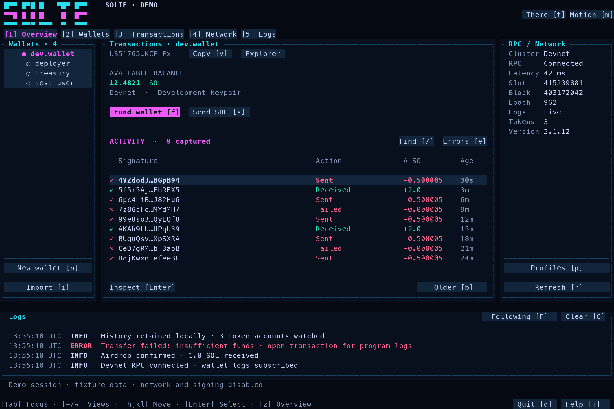

# Solte

A terminal wallet for Solana development. Manage project identities, fund wallets, inspect transactions, and keep network diagnostics beside your editor.



## Run

Requires Rust 1.97.1 or newer and a terminal with mouse support. Solte targets macOS and Linux. A C toolchain is needed when building the bundled SQLite dependency from source.

```sh
cargo build --release --locked
./target/release/solte --project /path/to/your/solana-project
```

To install the executable in your Cargo bin directory:

```sh
cargo install --path . --locked
cd /path/to/your/solana-project
solte
```

Devnet is the default. Press `p` or click **RPC profiles** to switch to Localnet or add a custom HTTP and WebSocket endpoint. Mainnet can be inspected, but funding and signing are disabled based on the endpoint's genesis hash.

Useful launch options:

```sh
solte --demo                     # Explore labeled fixtures; no signing or network calls
solte --offline                  # Browse captured local records
solte --profile Localnet         # Select a saved profile
solte --check                    # Read-only RPC diagnostic
solte --reduced-motion           # Disable panel transitions
solte --demo --snapshot view.svg # Render the actual terminal buffer to SVG
```

## Wallets and transactions

Solte discovers the nearest project through `.solte/config.toml`, `Anchor.toml`, or `.git`. It reads the Anchor provider wallet and valid keypair JSON files in the project root, `keys/`, `wallets/`, `.solte/keys/`, and `target/deploy/`. Program keypairs in `target/deploy/` appear as read-only identities.

Create a wallet with `n` or **New identity**. New keys use standard Solana JSON in `.solte/keys/`; existing names are never overwritten. Imported keys stay at their original paths. Both remain usable with Anchor and the Solana CLI.

Use `f` to request SOL. Use `s` to enter a recipient and amount, inspect an unsigned simulation, then explicitly sign and submit. The review shows the network, amount, fee, compute usage, and available program logs. A failed simulation cannot be submitted. When confirmation is uncertain, Solte keeps the signature so you can check it before retrying.

Click a transaction row or press Enter to inspect its error, logs, instructions, inner instructions, and token balance metadata. Explorer and copy actions are available by mouse and keyboard. Copy uses the terminal's OSC 52 clipboard support. Custom RPC URLs that may contain credentials are not sent to an external explorer.

## Navigation

| Action | Keys |
|---|---|
| Switch panels | Tab / Shift-Tab |
| Jump to wallets / activity / network / logs | 1 / 2 / 3 / 4 |
| Navigate options within the focused panel | h / j / k / l, or arrow keys |
| Scroll the current list or view | Page Up / Page Down |
| Activate the focused option | Enter |
| Create / import / cycle identity | n / i / ] |
| Fund / send SOL | f / s |
| RPC profiles / refresh | p / r |
| Filter transactions / failures only | / / e |
| Fetch or load older records | b |
| Open transaction explorer / copy wallet address | o / y |
| Follow logs / clear visible logs | F / C |
| Cycle activity tabs | v |
| Cycle theme / reduced motion | t / m |
| Expand focused panel | z, or the panel's + button |
| Help / close dialog / quit | ? / Escape / q |

Buttons, tabs, wallets, transaction rows, profile choices, and form fields are clickable. The mouse wheel scrolls the panel beneath it. Narrow windows show the focused panel; the top navigation keeps every panel accessible. Short panes use a compact header, single-row wallet controls, and scrollable activity. Short dialogs show one field at a time with Previous and Next controls. The minimum supported size is 60 columns by 10 rows; 120 by 36 or larger provides more room. Below the minimum, Solte reports the actual column and row count.

The underlined control has keyboard focus. Directional navigation stays inside the selected panel until you press k/up at its top edge. This focuses the main selector: h/l selects a panel, and j/down or Enter enters it. Enter on a control activates the same action as a mouse click. In text fields, type normally, use left/right to move the cursor, and Tab/Shift-Tab to change fields.

## Local data and monitoring

Solte keeps project data in an ignored `.solte/` directory:

- `config.toml`: identity labels and paths, network profiles, theme, and motion preference.
- `keys/`: newly generated standard keypair files.
- `history.sqlite`: captured transactions, per-account paging cursors, and operation logs.
- `diagnostics.log`: internal application diagnostics.

New keyfiles and configuration files use owner-only permissions on macOS/Linux. Keyfiles and custom RPC credentials are plaintext local files; the first release does not include an encrypted vault. Private keys are not stored in the history database.

Wallet log subscriptions provide live notifications. HTTP refreshes recover available history every 15 seconds and poll up to 32 discovered classic SPL and Token-2022 accounts. The interface reports incomplete coverage. Failed simulations performed by Solte are retained in the operation log.

History is separated by endpoint, wallet, and genesis hash. The interface initially loads 1,000 captured records; **Older history** expands the window in 250-record steps up to 10,000 and fetches older RPC pages when needed. Additional captured records remain in SQLite. Recent operation logs are bounded to 1,000 entries per wallet/endpoint.

Current limits:

- Monitoring runs while Solte is open. Reopening recovers data the RPC still serves; it cannot reconstruct pruned history or historical closed token accounts it never observed.
- Transactions submitted by another application are visible if they reach the chain and involve a watched address. Rejected approvals and preflight failures from other applications require a future integration.
- Transaction detail decoding requests legacy and v0 support. Unsupported versions or unavailable metadata remain explicit in the inspector.
- Transfers currently support native SOL. Token creation, token transfers, browser pairing, and hardware wallets are outside this release.
- Devnet airdrops depend on faucet availability and rate limits. Custom development chains must expose compatible Solana RPC methods.

## Development and verification

```sh
cargo fmt --check
cargo test --locked
cargo clippy --locked --all-targets -- -D warnings
cargo build --locked
python3 scripts/terminal_smoke.py
```

The regular tests cover exact amount parsing, file protection, project discovery, history isolation and paging, layout bounds, input handling, modal mouse isolation, and mocked RPC behavior. The terminal smoke test creates disposable wallets through both keyboard and mouse input.

To verify real funding and transfers, run an isolated local validator and provide its endpoints:

```sh
SOLTE_TEST_RPC=http://127.0.0.1:8899 \
SOLTE_TEST_WS=ws://127.0.0.1:8900 \
cargo test --test localnet -- --ignored

python3 scripts/terminal_smoke.py \
  --local-rpc http://127.0.0.1:8899 \
  --local-ws ws://127.0.0.1:8900
```

These checks only accept loopback RPC endpoints and create disposable keypairs. The terminal test also requires `solana-keygen` on PATH. The CI workflow runs the regular checks and offline terminal smoke test on macOS and Linux.

The source is organized around wallet operations, network monitoring, local storage, application state, rendering, and runtime coordination. Rendering does no network or disk I/O. A session identifier prevents stale responses from updating a newly selected wallet or profile.
